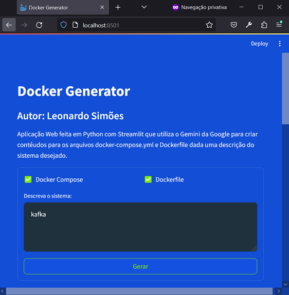
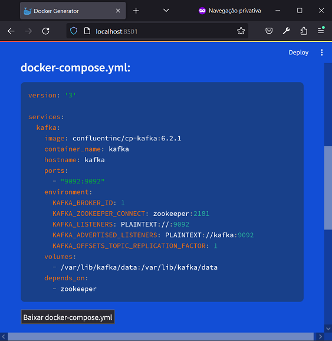
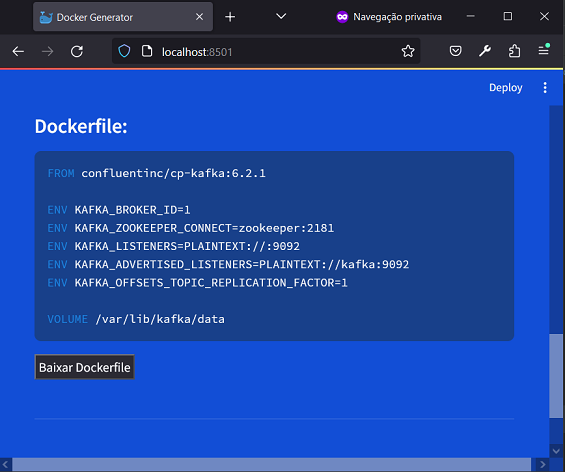

# Docker Generator
Autor: Leonardo Simões

Aplicação Web feita em Python com Streamlit que utiliza o Gemini da Google para criar conteúdos para os arquivos
`docker-compose.yml` e `Dockerfile` dada uma descrição do sistema desejado.

## Estrutura do projeto
Os arquivos do projeto são:
- `Docker_Generator.py`: script principal da aplicação, define como é a página web;
- `chats.py`: script com funções para carregar a API KEY de um arquivo e criar o objeto chat;
- `services.py`: definição da classe `GeminiService` e da função `create_gemini_service()`;
- `./streamlit/config.toml`: configurações das cores do tema;
- `requirements.txt`: arquivo com as dependências do projeto;
- `GOOGLE_API_KEY.txt`: arquivo que contém a chave de API obtido no Google AI Studio;
- `primeiro_prompt.txt`: arquivo que contém o prompt usado no Google AI Studio antes de exportar o modelo;
- `.gitignore`: arquivo com configurações do Git para ignorar certos diretórios e arquivos.

Em **Docker_Generator.py** há um objeto da classe `GeminiService` criado pela função `create_gemini_service()` 
definida em **services.py**. 

Em **services.py**, a classe `GeminiService` possui um atributo `_chat` que é inicializado com o retorno da função 
`create_chat()` definida em **chats.py**.

## Instruções para execução da aplicação
Para executar a aplicação localmente:
- instale Python e depois as dependências com `pip install -r requirements.txt`;
- insira a chave de Api do Gemini no arquivo `GOOGLE_API_KEY.txt`;
- execute o comando `streamlit run Docker_Generator.py` no terminal;
- acesse `http://localhost:8501/` pelo navegador.

Ao acessar a aplicação, o usuário deve:
- marcar se deseja gerar o Docker composer e/ou Dockerfile;
- inserir as tecnologias a serem inseridas na aplicação (ex.: Kafka, MySQL);
- clicar no botaão "Gerar".

Após executar estes passos, o usuário pode copiar o conteúdo gerado
ou clicar no botão correspondente para baixar o arquivo.

## Examplos de execução da aplicação

